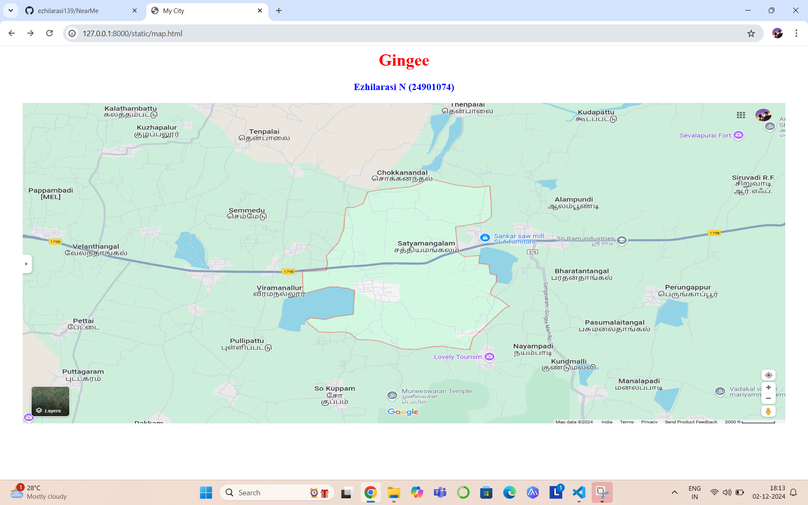
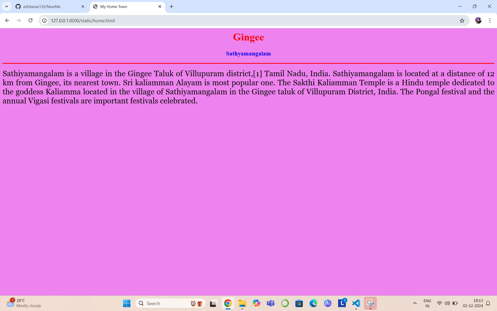
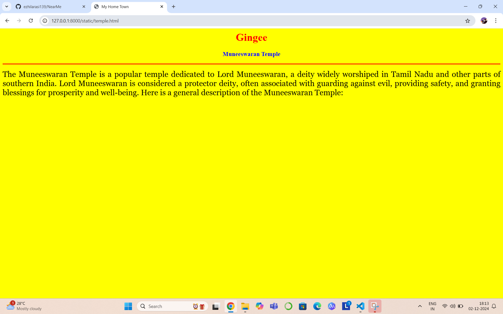
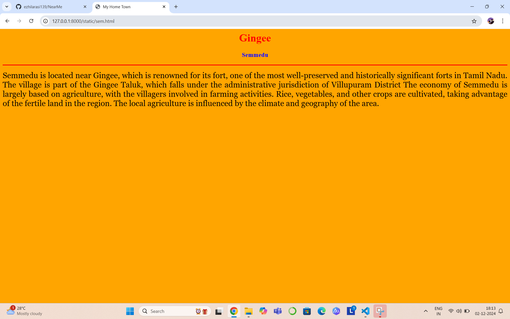
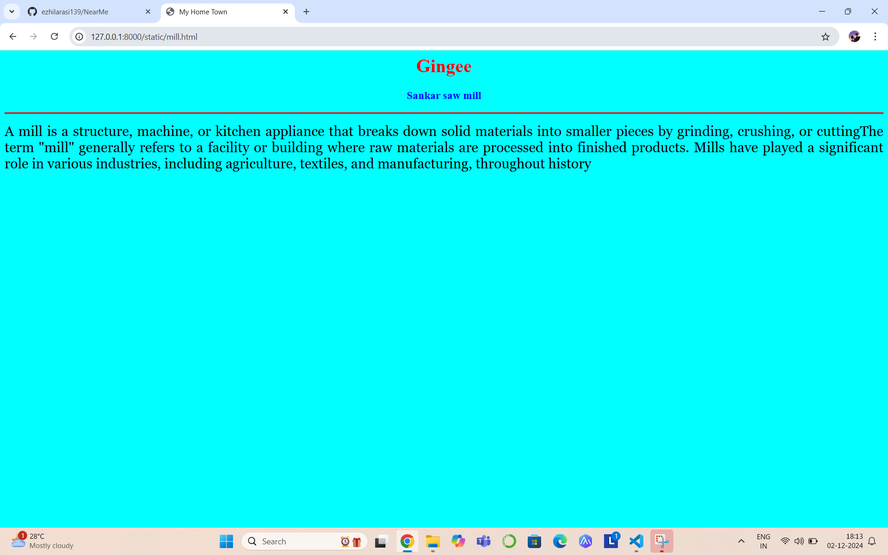
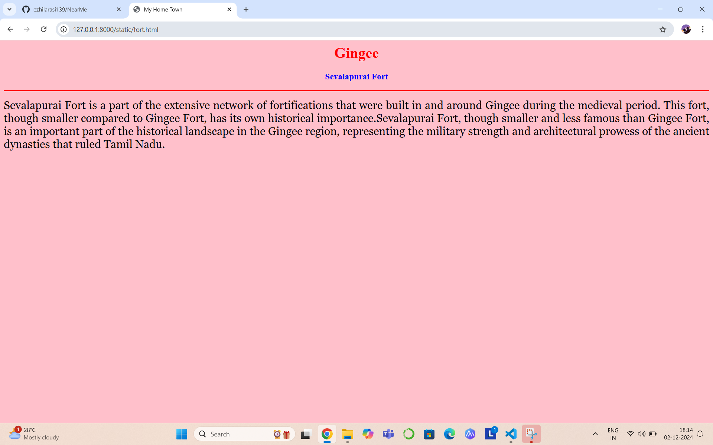

# Ex04 Places Around Me
## Date: 03.12.2024

## AIM
To develop a website to display details about the places around my house.

## DESIGN STEPS

### STEP 1
Create a Django admin interface.

### STEP 2
Download your city map from Google.

### STEP 3
Using ```<map>``` tag name the map.

### STEP 4
Create clickable regions in the image using ```<area>``` tag.

### STEP 5
Write HTML programs for all the regions identified.

### STEP 6
Execute the programs and publish them.

## CODE
```
map.html
<html>

<head>

<title>My City</title>

</head>

<body>

<h1 align="center">

<font color="red"><b>Gingee</b></font>

</h1>

<h3 align="center">

<font color="blue"><b>Ezhilarasi N (24901074)</b></font>

</h3>

<center>


<map name="MyCity">

<area shape="rect" coords="600,150,900,480" href="home.html" title="My Home Town">
<area shape="rect" coords="600,400,900,800" href="temple.html" title="Muneeswaran Temple">
<area shape="rect" coords="700,200,1000,300" href="mill.html" title="Sankar saw mill">
<area shape="rect" coords="300,150,1000,300" href="sem.html" title="Semmedu">
<area shape="rect" coords="1500,200,1200,20" href="fort.html" title="Sevalapurai Fort">

</map>

</center>

</body>

</html>

fort.html
<html>

<head>

<title>My Home Town</title>

</head>

<body bgcolor="pink">

<h1 align="center">

<font color="red"><b>Gingee</b></font>

</h1>

<h3 align="center">

<font color="blue"><b>Sevalapurai Fort</b></font>

</h3>

<hr size="3" color="red">

<p align="justify">

<font face="Georgia" size="5">

    Sevalapurai Fort is a part of the extensive network of fortifications that were built in and around Gingee during the medieval period. This fort, though smaller compared to Gingee Fort, has its own historical importance.Sevalapurai Fort, though smaller and less famous than Gingee Fort, is an important part of the historical landscape in the Gingee region, representing the military strength and architectural prowess of the ancient dynasties that ruled Tamil Nadu.

</p>

</body>

</html>

mill.html

<html>

<head>

<title>My Home Town</title>

</head>

<body bgcolor="cyan">

<h1 align="center">

<font color="red"><b>Gingee</b></font>

</h1>

<h3 align="center">

<font color="blue"><b>Sankar saw mill</b></font>

</h3>

<hr size="3" color="red">

<p align="justify">

<font face="Georgia" size="5">

    A mill is a structure, machine, or kitchen appliance that breaks down solid materials into smaller pieces by grinding, crushing, or cuttingThe term "mill" generally refers to a facility or building where raw materials are processed into finished products. Mills have played a significant role in various industries, including agriculture, textiles, and manufacturing, throughout history

</p>

</body>

</html>

sem.html

<html>

<head>

<title>My Home Town</title>

</head>

<body bgcolor="orange">

<h1 align="center">

<font color="red"><b>Gingee</b></font>

</h1>

<h3 align="center">

<font color="blue"><b>Semmedu</b></font>

</h3>

<hr size="3" color="red">

<p align="justify">

<font face="Georgia" size="5">

    Semmedu is located near Gingee, which is renowned for its fort, one of the most well-preserved and historically significant forts in Tamil Nadu. The village is part of the Gingee Taluk, which falls under the administrative jurisdiction of Villupuram District  The economy of Semmedu is largely based on agriculture, with the villagers involved in farming activities. Rice, vegetables, and other crops are cultivated, taking advantage of the fertile land in the region. The local agriculture is influenced by the climate and geography of the area.


</p>

</body>

</html>

temple.html

<html>

<head>

<title>My Home Town</title>

</head>

<body bgcolor="yellow">

<h1 align="center">

<font color="red"><b>Gingee</b></font>

</h1>

<h3 align="center">

<font color="blue"><b>Muneeswaran Temple</b></font>

</h3>

<hr size="3" color="red">

<p align="justify">

<font face="Georgia" size="5">

    The Muneeswaran Temple is a popular temple dedicated to Lord Muneeswaran, a deity widely worshiped in Tamil Nadu and other parts of southern India. Lord Muneeswaran is considered a protector deity, often associated with guarding against evil, providing safety, and granting blessings for prosperity and well-being. Here is a general description of the Muneeswaran Temple:


</p>

</body>

</html>

home.html

<html>

<head>

<title>My Home Town</title>

</head>

<body bgcolor="violet">

<h1 align="center">

<font color="red"><b>Gingee</b></font>

</h1>

<h3 align="center">

<font color="blue"><b>Sathyamangalam</b></font>

</h3>

<hr size="3" color="red">

<p align="justify">

<font face="Georgia" size="5">

    Sathiyamangalam is a village in the Gingee Taluk of Villupuram district,[1] Tamil Nadu, India. Sathiyamangalam is located at a distance of 12 km from Gingee, its nearest town. Sri kaliamman Alayam is most popular one. The Sakthi Kaliamman Temple is a Hindu temple dedicated to the goddess Kaliamma located in the village of Sathiyamangalam in the Gingee taluk of Villupuram District, India. The Pongal festival and the annual Vigasi festivals are important festivals celebrated.

</p>

</body>

</html>
```

## OUTPUT












## RESULT
The program for implementing image maps using HTML is executed successfully.
